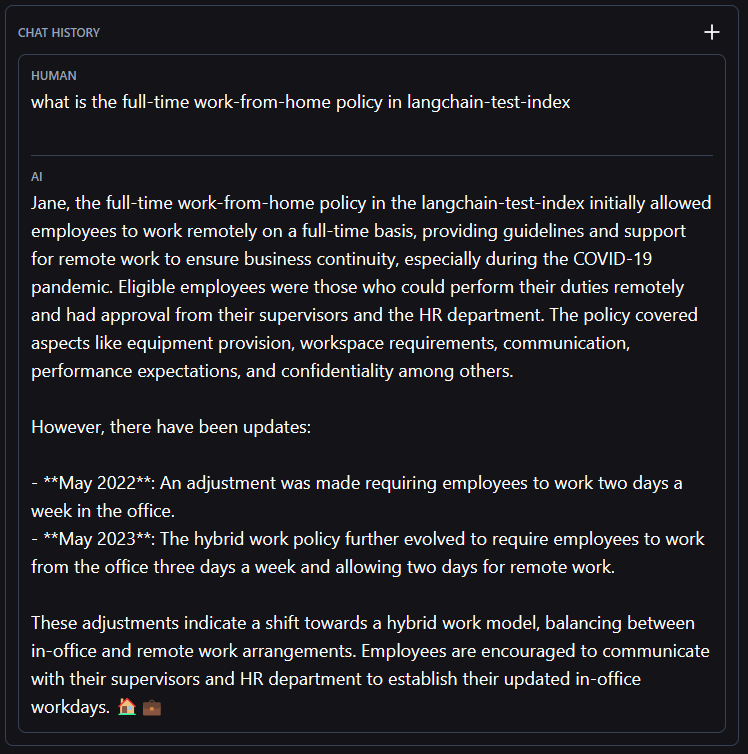

# Langchain+Prompty+Pinecone

## How to run locally

### Prerequisite
In order to host this app, you need to have:

- A Pinecone account with a valid API key.
- An Azure OpenAI endpoint with two deployments: one GPT deployment for chat and one embedding deployment for embedding.
- A created index in your Pinecone account consistent with the index name in `test-app\packages\openai-functions-agent\openai_functions_agent\agent.py`. By default it is called `langchain-test-index`
- Put the data you want pinecone work with in `test-app\packages\openai-functions-agent\openai_functions_agent\data` folder and change the data file name in `agent.py` (change the `local_load` settings as well)


### dependency requirements:

- Python=3.11
- poetry==1.6.1

### go to `test-app` folder and do followings:

1. use poetry to install all dependency
`RUN poetry install --no-interaction --no-ansi`

1. set environment variables(on Windows)

```ps1
$Env:PINECONE_API_KEY = <your pinecone api key>
$Env:AZURE_OPENAI_API_KEY= <your aoai api key>
$Env:AZURE_OPENAI_ENDPOINT= <your aoai endpoint>
$Env:OPENAI_API_VERSION= <your aoai api version>
$Env:AZURE_DEPLOYMENT= <your aoai deployment name for chat>
$Env:AZURE_OPENAI_EMBEDDING_DEPLOYMENT= <your aoai deployment name for embedding>
```

3. Now try to run it on your local
`langchian serve`

1. you can go to http://localhost:8000/openai-functions-agent/playground/ to test.

1. you can mention your index in `input` to tell agent to use search tool.
e.g. 

## deploy to Azure container app
```dotnetcli
az containerapp up --name [container-app-name] --source . --resource-group [resource-group-name] --environment  [environment-name] --ingress external --target-port 8001 --env-vars=<your env vars>
```
You can find more info [here](https://learn.microsoft.com/en-us/azure/container-apps/containerapp-up)
